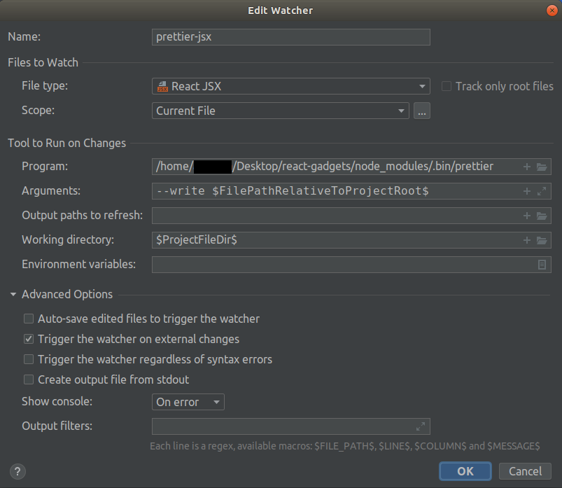
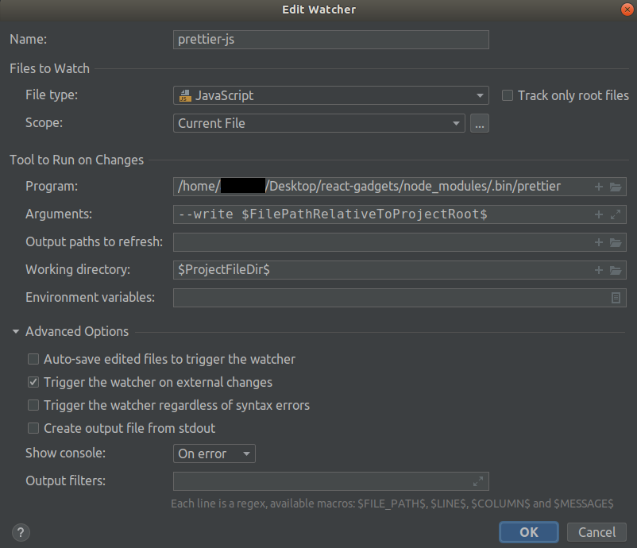

# Documentation

## Development

### 1. Important Notes!

#### File naming convention

- React Components / Test / Story (Eg. MyComponent.jsx / MyComponent.test.js / MyComponent.story.js) -- CamelCase
- Javascript Files (Eg. my-component.js) -- small letter with dashes
- Markdown (eg. README.md) -- usually CAPS

#### Possible Issues

These are possible issues you might faced when coding your React components

1. jest.mock factory doesn't work inside a test.
    - Details: `using jest.mock() to mock a React component does not work if you place it inside test/it/describe functions`
    - Solution: 
    - Reference: [jest.mock factory doesn't work inside a test](https://github.com/facebook/jest/issues/2582)

#### Writing Test Cases

- we are using `react-test-library` which is meant for replicating user's actions. Hence, the test cases should revolve around that
- use `describe` to group test cases
- `structural testing` is automatically generated using `@storybook/addon-storyshots` but you can always follow the sample do `snapshot testing`
- use `data-testid` in your HTML Dom for easy reference when testing
- for components with sub components, follow this logic
    - **E2E test (on Parent) is the preferred approach, as this is how the user experiences the functionality.**
    - **If Child contains local logic which is not exposed to the Parent via props - like internal state management - then it makes sense to test the Child separately to cover that extra logic.**

##### Possible Issues with Testing

1. Parent vs Child Testing
2. jest.mock(modules) only works outside of describe/it/test functions
3. getTestById will not work if there are multiple child components in parent component

### 2. Running the Library Locally

#### Creating new component

Follow the steps below to add additional components to `react-gadgets`

1. Create a folder for your component inside `src/components` folder
2. Using Test-Driven Development approach, you should create test cases first. Create a unit test `<Name>.test.js`
    - Run `yarn test:watch` to run the unit tests
    - Run `yarn test` to get test coverage
3. Create your React Component `<Name>.jsx`
4. If you require CSS for your components, create a css module file `<Name>.module.css`
5. To check on your React Component locally, create a story `<Name>.story.js`
    - Run `yarn run storybook` && check your component in `http://localhost:6006/`
    - Note:
        - Changes are usually automatically reloaded
        - Documentations in storybook are automatically generated thanks to `@storybook/addon-docs`

To run this library locally, clone the repo.
    - Run `yarn install` to install the packages

#### Testing

1. `yarn run test` : runs jest and check for test coverage (should be used in your CI/CD pipeline)
2. `yarn run test:watch`: should be used when you're running your tests locally (they will re-run whenever a file is changed).
    - *Note: press `u` to update snapshot if you make changes to any components*
3. `yarn run lint` : check for code consistency

###### Additional Testing Notes
- Jest / React-Testing-Library Basics
    - `it or test`: describes the test itself. It takes as parameters the name of the test and a function that holds the tests.
    - `describe`: is a way to group the test. We use it to define user behaviour
    - `expect`: the condition that the test needs to pass. It will compare the received parameter to a matcher.
    - `render`: the method used to render a given component.
        - *Note: the [render method](https://testing-library.com/docs/react-testing-library/api) returns several methods we can use to test our features.*
- Types of Testing done:
    1. Structural Testing (via Storybook addon "StoryShots" which is an integration of Jest's Snapshot)
        - Refer to `src/tests/storybook.snapshot.test.js` for the implementation of structural testing for stories
        - Refer to `src/components/0-Sample/Sample.test.js` for the implementation of snapshot testing for components
        - Snapshot Testing is done automatically when running `yarn run test`
    2. Behaviour Driven Testing
        - The idea of react-testing-library is to reproduce actions a user would do to the application.  
        - Using `describe`, we try to group similar user actions.     
    3. CSS / Style Testing
- Coverage
    - Running `yarn run test` will prints the coverage. Some basics on jest coverage:
        - **Function Coverage (% Funcs)** -- Has each function in the program been called? 
        - **Statement Coverage (% Stmts)** -- Has each statement in the program been executed?
        - **Branch Coverage (% Branch)** -- Has each branch of each control structure (such as if-else / switch) been executed?
        - **Line Coverage(% Lines)** -- Has each executable line in the source file been executed?

#### Building

1. `yarn install` -- install the node packages
2. `yarn run build` -- build the library

#### Storybook

1. `yarn run storybook` -- run storybook
2. `http://localhost:6006` -- open in internet browser to view storybook locally

### 3. Publishing to NPM

## Setting up Project in IntelliJ [Optional]

- [Set up Prettier](https://www.jetbrains.com/help/idea/prettier.html#ws_prettier_reformat_code)
- [File Watcher](https://blog.jetbrains.com/webstorm/2016/08/using-external-tools/)
    - Install File Watcher Plugin.
    - Go to `File -> Settings -> Tools -> FileWatcher` and click on the `+` button
    - Add the following config
        - 
        - 
        - 
        - 
        